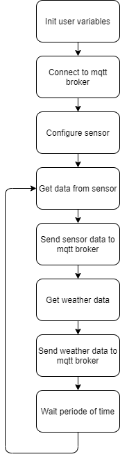

# IoT-Geenhouse: Subproject Air

## Goals of the Subproject

Provide relevant data about air condition including temperature, pressure, CO2, humidity of inside and outside of the greenhouse

## List of Requirements Group01

 * Connect to mqtt broker and send example data of inside and outside air condition
 * Get actual weather data
 * Send weather data to mqtt broker
 * Get actual air data of inside via BME688 Sensor
 

## Overview Hardware System
 
 * We use a RaspberryPi 3 or 4 as computing hardware (including SD card, power supply, etc.)

 * We found a breakoutboard with a sensor which measures the value we need:
 https://pi3g.com/de/products/bme688-breakout-board/
 Bought at:
 https://www.reichelt.de/entwicklerboards-sensor-bosch-bme688-debo-sens-bme688-p306628.html?&trstct=pos_0&nbc=1 (30,95€)

## Preparation for Startup

* Install following libraries:
  * **paho-mqtt**
    https://pypi.org/project/paho-mqtt/
    Install by running ``pip install paho-mqtt``

  * **bme68x-python-library**
    https://github.com/pi3g/bme68x-python-library
    Follow the instructions on README-file to install.
    Don't forget the BSEC2.0 library from BOSCH.

* Attach breakout board on raspberry

## Program flowchart

##  Developers and authors Subproject
 * Claudio Oechsler
 * Marvin Filipon
 * Daniel Kurz
 * Nicolas Fimbel